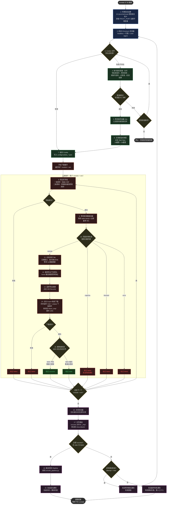

# Echotik Collector 运行流程图

```mermaid
flowchart TD
    START(["crontab 07:30 触发"])

    START --> PROXY["1. 代理自动设置<br/>从 /proc/net/route 获取宿主机IP<br/>拼接 PROXY_PORT 设置环境变量"]
    PROXY --> BROWSER["2. 启动 Chromium 浏览器<br/>headless + 代理 + User-Agent"]
    BROWSER --> COOKIE_CHECK{"3. Cookie 文件<br/>存在且有效?"}

    COOKIE_CHECK -- "有效" --> SAVE_COOKIE["7. 保存 Cookie<br/>写入 config/cookies_*.json"]
    COOKIE_CHECK -- "失效/不存在" --> LOGIN["4. 账号密码登录（5步）<br/>导航登录页→等待表单→<br/>填账号密码→点登录→检测结果"]

    LOGIN --> LOGIN_OK{"登录成功?<br/>检测到 Hi, 字样"}
    LOGIN_OK -- "成功" --> WAIT_BOARD["5. 等待首页加载 15s<br/>让动态内容渲染完毕"]
    LOGIN_OK -- "失败" --> MORE_ACCT{"还有其他账号?"}
    MORE_ACCT -- "是" --> COOKIE_CHECK
    MORE_ACCT -- "否" --> ABORT(["终止：所有账号登录失败"])

    WAIT_BOARD --> POPUP["6. 关闭新版本弹窗<br/>点击 Start Now<br/>2s截图 + 5s截图"]
    POPUP --> SAVE_COOKIE

    SAVE_COOKIE --> LOOP_START["开始下载循环<br/>遍历每个 module × win"]

    subgraph DOWNLOAD_LOOP ["下载循环（每个 module × win）"]
        direction TB
        NAV["8. 侧边栏导航<br/>一级菜单（选品/小店）→<br/>二级菜单（热销榜/最佳跨境卖家）"]
        NAV --> NAV_OK{"导航成功?"}
        NAV_OK -- "失败" --> MARK_FAILED_NAV["标记 failed"]
        NAV_OK -- "成功" --> WAIT_DATA["9. 等待榜单数据加载<br/>等待 table tbody tr 出现<br/>最多 60s"]

        WAIT_DATA --> ANOMALY{"10. 页面异常检测<br/>规则扫描页面"}
        ANOMALY -- "normal" --> TAB["11. 点击时间 Tab<br/>日榜跳过，周/月榜点Tab<br/>等待 3s 数据刷新"]
        ANOMALY -- "captcha" --> MARK_FAILED_CAP["标记 failed<br/>发送风控通知"]
        ANOMALY -- "blocked" --> MARK_FAILED_BLK["标记 failed"]
        ANOMALY -- "error" --> MARK_FAILED_ERR["标记 failed"]

        TAB --> DROPDOWN["12. 悬停导出下拉箭头<br/>hover 触发条数菜单弹出"]
        DROPDOWN --> COUNT["13. 选择导出条数<br/>点击 200 Records"]
        COUNT --> EXPORT["14. 点击 Export 触发下载<br/>同时监听 main + popup 下载事件<br/>保存到 inbox/_tmp/<br/>超时 120s"]
        EXPORT --> EXPORT_OK{"下载成功?"}
        EXPORT_OK -- "失败" --> MARK_FAILED_EXP["标记 failed"]
        EXPORT_OK -- "成功" --> FRESH{"15. 新鲜度检测<br/>MD5 对比历史文件"}
        FRESH -- "MD5 不同<br/>数据已更新" --> MARK_SUCCESS["标记 success"]
        FRESH -- "MD5 相同<br/>数据未更新" --> MARK_STALE["标记 stale"]
    end

    LOOP_START --> NAV

    MARK_FAILED_NAV --> NEXT_TASK
    MARK_FAILED_CAP --> NEXT_TASK
    MARK_FAILED_BLK --> NEXT_TASK
    MARK_FAILED_ERR --> NEXT_TASK
    MARK_FAILED_EXP --> NEXT_TASK
    MARK_SUCCESS --> NEXT_TASK
    MARK_STALE --> NEXT_TASK

    NEXT_TASK{"还有下一个<br/>module × win?"}
    NEXT_TASK -- "是" --> NAV
    NEXT_TASK -- "否" --> CLOSE_BROWSER

    CLOSE_BROWSER["16. 关闭浏览器<br/>无论成功与否立即关闭"]
    CLOSE_BROWSER --> ROUTE["17. 文件路由<br/>success 文件从 _tmp/<br/>移动到 inbox/d|w|m/"]

    ROUTE --> ALL_OK{"全部 success?<br/>无 stale 无 failed"}
    ALL_OK -- "是" --> PIPELINE["18. 触发清洗 Pipeline<br/>调用 echotik_pipeline.py"]
    ALL_OK -- "否" --> RETRY_LEFT{"还有重试机会?<br/>attempt < max"}

    PIPELINE --> NOTIFY_OK["19. 发送成功通知<br/>完成时间 + 模块列表"]
    NOTIFY_OK --> DONE(["进程结束<br/>等待下次 crontab"])

    RETRY_LEFT -- "是" --> NOTIFY_WAIT["发送等待重试通知<br/>失败原因"]
    RETRY_LEFT -- "否" --> NOTIFY_FAIL["发送最终失败通知<br/>失败模块列表，需人工介入"]

    NOTIFY_WAIT --> BROWSER
    NOTIFY_FAIL --> DONE

    %% 样式
    classDef startEnd fill:#2d2d2d,stroke:#888,color:#fff,stroke-width:2px
    classDef process fill:#1a2744,stroke:#4f8ef7,color:#e0e0e0
    classDef login fill:#1a3322,stroke:#4fc97a,color:#e0e0e0
    classDef download fill:#331a1a,stroke:#f77c4f,color:#e0e0e0
    classDef finish fill:#2a1a2a,stroke:#c94fc9,color:#e0e0e0
    classDef decision fill:#2d2d1a,stroke:#f7c94f,color:#e0e0e0
    classDef fail fill:#3a1a1a,stroke:#f74f4f,color:#f74f4f
    classDef success fill:#1a3a1a,stroke:#4fc97a,color:#4fc97a

    class START,DONE,ABORT startEnd
    class PROXY,BROWSER process
    class LOGIN,WAIT_BOARD,POPUP,SAVE_COOKIE login
    class NAV,WAIT_DATA,TAB,DROPDOWN,COUNT,EXPORT download
    class CLOSE_BROWSER,ROUTE,PIPELINE,NOTIFY_OK,NOTIFY_WAIT,NOTIFY_FAIL finish
    class COOKIE_CHECK,LOGIN_OK,MORE_ACCT,NAV_OK,ANOMALY,EXPORT_OK,FRESH,NEXT_TASK,ALL_OK,RETRY_LEFT decision
    class MARK_FAILED_NAV,MARK_FAILED_CAP,MARK_FAILED_BLK,MARK_FAILED_ERR,MARK_FAILED_EXP fail
    class MARK_SUCCESS,MARK_STALE success
    class LOOP_START download
```
